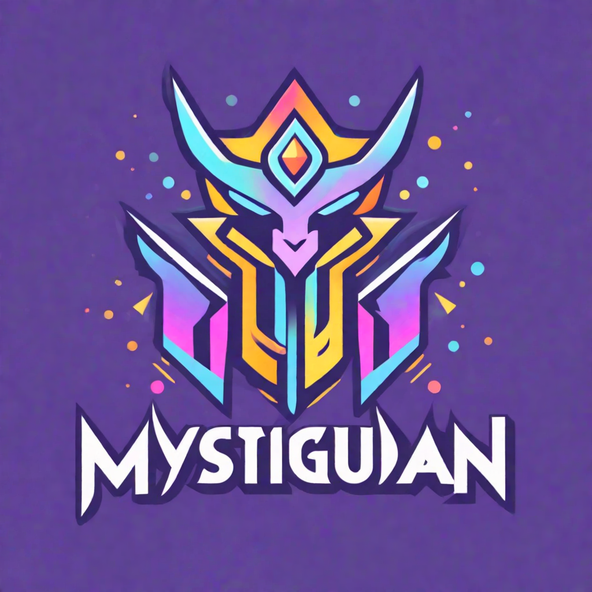

<div align="center">
    
</div>

MystiGuardian - Your server's mystical protector and entertainment extraordinaire. Uniting moderation with fun, it
ensures a secure and delightful Discord experience.

The following is required in your config.json file:

```json
{
  "token": "",
  "owner-id": "",
  "youtube": {
    "apiKey": "",
    "channelId": "",
    "discordChannelId": "",
    "guildId": ""
  },
  "dataSource": {
    "user": "",
    "password": "",
    "driver": "org.postgresql.Driver",
    "port": "",
    "name": "postgres",
    "host": "",
    "url": ""
  },
  "discord-auth": {
    "clientId": "",
    "clientSecret": ""
  }
}
```

You will also need a public and private key for the bot to use for encryption. These should be placed in your home directory under the names `public.key` and `private.key` respectively.